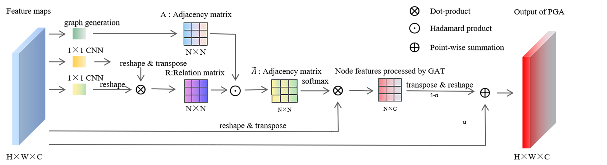
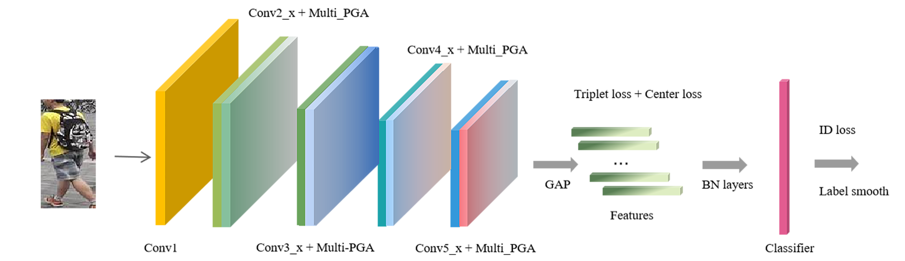

# Pixel-wise Graph Attention Networks for Person Re-identification (PGANet)
Pixel-wise Graph Attention Networks for Person Re-identification. ACM MM2021, Poster.


The codes are expanded on [[Strong baseline]](https://github.com/michuanhaohao/reid-strong-baseline).


## 1 Pipeline

This article proposes a feature extraction module based on pixel-wise graph attention, which treats image pixels as nodes on the graph and pixels surrounding them as neighbors. The graph attention mechanism is used to update image features. We insert this module into each layer in ResNet to enhance the components extracted by ResNet. The module details are as follows:


The following figure is the architecture diagram of the model:




## 2 Get Started


### 2.1 Environment
PyTorch, pytorch_ignite==0.1.2, yacs, and soon.

### 2.2 Dataset


Create a directory to store reid datasets under this repo or outside this repo. Remember to set your path to the root of the dataset in `config/defaults.py` for all training and testing or set it in every config file in `configs/` or in every single command.

You can create a directory to store reid datasets under this repo via


（1）Market1501

* Download dataset to `data/` from http://www.liangzheng.org/Project/project_reid.html
* Extract dataset and rename to `market1501`. The data structure would like:

```bash
data
    market1501 # this folder contains 6 files.
        bounding_box_test/
        bounding_box_train/
        ......
```
（2）DukeMTMC-reID

* Download dataset to `data/` from https://github.com/layumi/DukeMTMC-reID_evaluation#download-dataset
* Extract dataset and rename to `dukemtmc-reid`. The data structure would like:

```bash
data
    dukemtmc-reid
        DukeMTMC-reID # this folder contains 8 files.
            bounding_box_test/
            bounding_box_train/
            ......
```
### 2.3 Prepare pretrained model
Download the corresponding model parameters from the series website, save them in the desired location, and change the location of the pre-trained model '_C.MODEL.PRETRAIN_PATH' in '/config/defaults.py' and 'configs/*.yml'.

```
model_urls = {
    'resnet50': 'https://download.pytorch.org/models/resnet50-19c8e357.pth',
    'resnet101': 'https://download.pytorch.org/models/resnet101-5d3b4d8f.pth',
    'resnet152': 'https://download.pytorch.org/models/resnet152-b121ed2d.pth',
} 
 ```

## 3 Train

You can run these commands in  `.sh ` files for training different datasets of different loss.  You can also directly run code `sh *.sh` to run our demo after your custom modification.


Experiment-all_tricks-tri_center-market-pga.sh：

```
python3 tools/train.py --config_file='configs/softmax_triplet_with_center_pga.yml' SOLVER.MAX_EPOCHS "(600)"  MODEL.DEVICE_ID "('1')" DATASETS.NAMES "('market1501')" DATASETS.ROOT_DIR "('your location')" MODEL.SGA_ON "('True')" MODEL.CGA_ON "('False')" MODEL.NUM_HEADS "(1)" OUTPUT_DIR "('your output log location')"
```

## 4 Test

Test-pga-all_tricks-tri_center-market.sh：

```
python3 tools/test.py --config_file='configs/softmax_triplet_with_center_pga.yml' MODEL.DEVICE_ID "('0')" DATASETS.NAMES "('market1501')" DATASETS.ROOT_DIR "('your location')" MODEL.PRETRAIN_CHOICE "('self')" TEST.WEIGHT "('your logcation/model.pth')"
```


## 5 Related Works 

· Bag of Tricks and A Strong Baseline for Deep Person Re-identification [[Paper]](https://arxiv.org/pdf/1903.07071.pdf) [[Code]](https://github.com/michuanhaohao/reid-strong-baseline)
